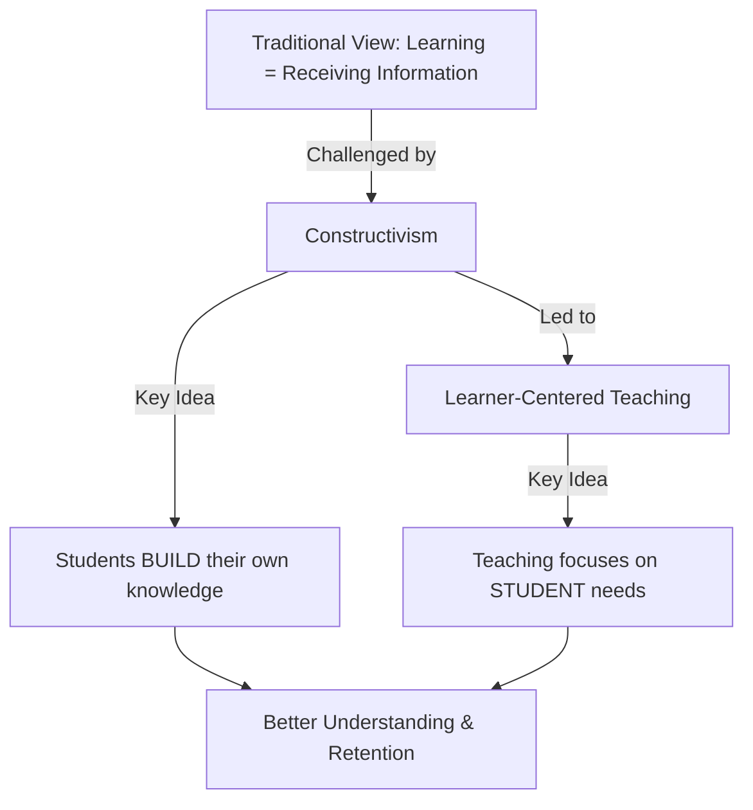
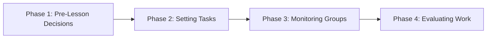
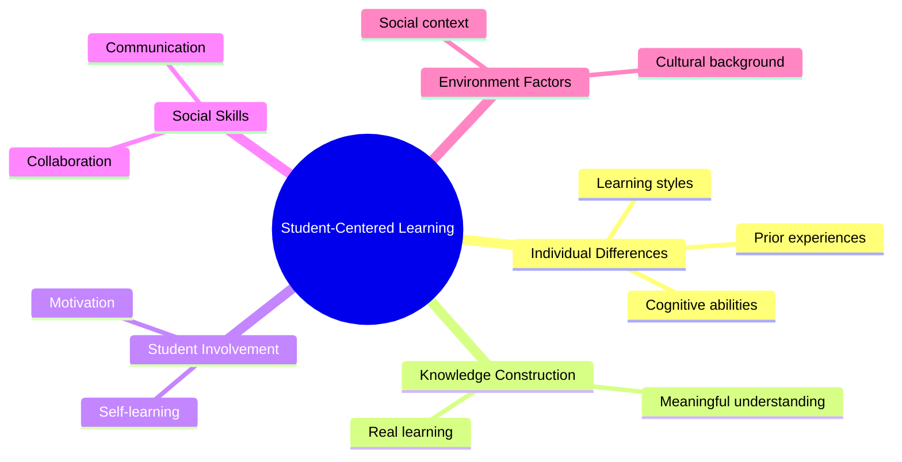
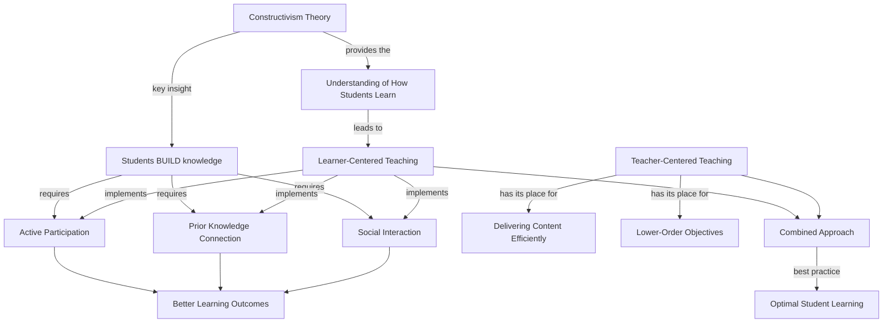

# Unit III: Theory of Constructivism and Learner-Centered Teaching

## 🎯 Unit Overview: The Big Picture

This unit explores **two interconnected revolutionary ideas** that transformed education in the 20th century:



### The Core Connection

| Old View | New View (This Unit) |
|----------|---------------------|
| Teacher gives knowledge → Student receives it | Student **constructs** knowledge with teacher's guidance |
| Teacher is the center | **Learner** is the center |
| Passive listening | Active participation |
| Memorization | Meaningful understanding |

---

## 3:00 Introduction

In the latter half of the 20th century, psychologists like **Vygotsky**, **Piaget**, **Bruner**, and **Ausubel** proposed a revolutionary view of learning called **constructivism**.

!!! info "The Revolutionary Insight"
    Learning is NOT simply receiving information from a teacher. Instead, it's a **process** where learners:
    
    1. Examine new information
    2. Use their **personal experiences** to make sense of it
    3. **Internalize** and **integrate** it with their existing knowledge

This led to a parallel movement: **Learner-Centered Teaching**, which insists that all aspects of teaching—planning, execution, and evaluation—should be **student-centered**, not teacher-centered or subject-centered.

---

## Part 1: Constructivism - How Students Build Knowledge

### 3:01 What is Knowledge Construction / Constructivism?

#### The Process Explained

When you learn something new, here's what actually happens:

```
┌─────────────────────────────────────────────────────────────┐
│                    YOUR EXISTING KNOWLEDGE                   │
│    (Built from your experiences, culture, background)        │
└─────────────────────────────────────────────────────────────┘
                              ⬇️
              New Information Arrives (from teacher, book, etc.)
                              ⬇️
┌─────────────────────────────────────────────────────────────┐
│                    PROCESSING STAGE                          │
│  • Compare with existing knowledge                           │
│  • Find connections and meaning                              │
│  • Accept, modify, or reject based on experiences            │
└─────────────────────────────────────────────────────────────┘
                              ⬇️
┌─────────────────────────────────────────────────────────────┐
│                    NEW UNDERSTANDING                         │
│    (Integrated with your existing cognitive structure)       │
└─────────────────────────────────────────────────────────────┘
```

!!! tip "Key Definition"
    **Learning (Constructivism)** = The process of making information **meaningful** in the background of one's social and cultural environment and registering it in memory.

#### What Learning is NOT

- ❌ Simply copying information received from outside
- ❌ Just seeing, hearing, or reading and memorizing
- ❌ Passively receiving knowledge from a teacher

#### What Learning IS

- ✅ Making received information **meaningful**
- ✅ **Assimilating** new information with existing knowledge
- ✅ **Constructing** your own understanding

#### The Teacher's New Role

In constructivism, the teacher is NOT a "dispenser of knowledge" but rather:

| Role | Description |
|------|-------------|
| **Cognitive Guide** | Helps students interact meaningfully with content |
| **Facilitator** | Creates suitable educational and social environment |
| **Co-Explorer** | Learns alongside students |

#### The Ideal Constructivist Classroom

- Students **question**, **challenge**, and **formulate** their own ideas
- **Active engagement**, **inquiry**, and **problem-solving** are emphasized
- **Collaboration** with others is encouraged
- Single "correct answers" are de-emphasized

---

### 3:02 Definitions of Constructivism

| Scholar | Definition |
|---------|------------|
| **Cannella & Reiff (1944)** | "Constructivism is an epistemology, a learning or meaning-making theory... individuals create or construct their own understandings or knowledge through the interactions and activities with which they have contact." |
| **Kroll & Boskey (1996)** | "Knowledge is acquired through involvement with content instead of imitation or repetition." |
| **Wolffe & McMullen (1996)** | "Constructivism is primarily a theory of learning, not a theory of teaching." |

---

### 3:03 Nature of the Constructivist Learner

Understanding the **six characteristics** of a constructivist learner:

#### 1. 🎯 Full Responsibility for Learning

- Understanding comes from **direct experiences**
- Active participation in learning activities is essential
- The learner owns their learning journey

#### 2. 💪 Self-Motivation is Essential

> "Only those who have confidence in their ability to learn are motivated to continuously involve themselves in learning activities." — Van Glaserfield (1989)

#### 3. 🏃 Active Involvement

Learning occurs through:

- Interaction with teacher and students
- Working together with others
- Searching for answers through inquiry
- Reflecting upon experiences

#### 4. 🤝 Collaboration with Peers

Why peer collaboration matters:

- Share different experiences and perspectives
- See possible interpretations from different angles
- Achieve complete interpretation of what is learned

#### 5. 🔍 Adopting an Inquiry Approach

The constructivist classroom provides opportunities for:

- Problem-solving
- Questioning
- Accessing variety of sources
- Critically analyzing information
- Testing solutions through personal experience

!!! warning "Critical Thinking Required"
    Don't accept solutions offered by others blindly—test them and accept their validity through personal experiences.

#### 6. 🪞 Reflecting on Learning Experiences

Reflection is crucial because:

- Direct experience alone is not enough
- Must select appropriate information
- Must integrate with existing knowledge
- Requires reflective and logical thinking capabilities

---

### 3:04 Role and Functions of Teacher in the Constructivist Classroom

The teacher in a constructivist classroom:

#### General Functions

| Function | Description |
|----------|-------------|
| Ask open-ended questions | Wait patiently for students to answer |
| Emphasize higher-order thinking | Focus on logical reasoning |
| Encourage interaction | Students interact with each other and teacher |
| Promote experience sharing | Students share among themselves |
| Emphasize inquiry-based learning | Learning through investigation |
| Focus on problem-solving | Real-world problem approaches |
| Use collaborative techniques | Group interactions, cooperative learning, jigsaw puzzles, project work |

#### The Four Phases of Cooperative Learning



##### 3:04:1 Phase 1: Making Decisions Before the Lesson

Teacher decides on two types of objectives:

| Objective Type | Description |
|----------------|-------------|
| **Academic Objectives** | Content knowledge and skills for the lesson |
| **Social Objectives** | Social interaction skills to be acquired |

##### 3:04:2 Phase 2: Setting the Learning Tasks

- Explain learning tasks to student groups
- Ensure students understand the tasks
- Emphasize both academic AND social skill development

##### 3:04:3 Phase 3: Monitoring and Intervening During Group Work

- Visit all groups during activities
- Assess learning progress
- Provide suggestions/assistance to lagging groups
- Stimulate groups to accomplish assigned tasks

##### 3:04:4 Phase 4: Evaluating the Product and Process

- Allow groups to assess their own achievement
- Allow groups to assess other groups
- Evaluate both lesson objectives AND social skills development

---

### 3:05 The Learning Process According to Constructivist Theory

#### Where Learning Happens: Working Memory

Knowledge construction occurs in **short-term (working) memory** through this process:

```
┌──────────────────────────────────────────────────────────────────┐
│                     LONG-TERM MEMORY                              │
│                   (Prior Knowledge Store)                         │
│           Audio Images 🔊    Visual Images 👁️                     │
└──────────────────────────────────────────────────────────────────┘
                              ⬆️ Select relevant prior knowledge
                              │
┌──────────────────────────────────────────────────────────────────┐
│                    SHORT-TERM (WORKING) MEMORY                    │
│                                                                   │
│   Step 1: SELECTING                                               │
│   • Select from incoming information                              │
│   • Select from prior knowledge                                   │
│   • Compare and interpret meaningfully                            │
│                              ⬇️                                    │
│   Step 2: ORGANIZING                                              │
│   • Classify new information                                      │
│   • Code as audio/video images                                    │
│                              ⬇️                                    │
│   Step 3: INTEGRATING                                             │
│   • Combine organized new knowledge with existing knowledge       │
│   • Modify cognitive structure                                    │
└──────────────────────────────────────────────────────────────────┘
                              ⬇️
                    ┌─────────────────┐
                    │   NEW LEARNING   │
                    │    ACHIEVED!     │
                    └─────────────────┘
```

!!! info "SOI Model"
    This three-step process is called the **SOI Model**:
    
    - **S** = Selecting
    - **O** = Organizing  
    - **I** = Integrating

---

### 3:06 Pedagogical Approaches to Constructivism

Four key teaching principles for constructivist classrooms:

#### Principle 1: Connect New Learning to Prior Knowledge

> "Learning is the process of connecting what we learn now, with what we already know."

**For Teachers:**

- Test students' prior knowledge before teaching
- Plan activities that help students connect new content to existing knowledge
- Remember: Prior knowledge can **facilitate**, **inhibit**, or **transform** learning

#### Principle 2: Relate Content to Real Life

- Present content related to students' day-to-day life
- Don't assume students will discover everything themselves
- Let students **test** what they learn in practical situations
- Help students understand content as the teacher intended

#### Principle 3: Use Social and Cultural Context

- Make students realize how they interpreted content in their social/cultural context
- Encourage **direct participation** in social activities
- Promote **collaborative learning**

#### Principle 4: Develop Pedagogical Content Knowledge (PCK)

**What is PCK?**

A combination of:

- Subject content knowledge
- Teaching practice experience
- Feedback from professors during training
- Personal schooling experiences
- Teaching experience in professional tenure

!!! success "A Good Teacher"
    A good teacher has:
    
    1. Good understanding of **subject content**
    2. Skills for **effective delivery**
    3. Knowledge of **students' abilities and backgrounds**

---

### 3:07 Learning Environment That Facilitates Constructivism

According to **Jonassen (1994)**, eight characteristics differentiate constructivist learning environments:

| # | Characteristic | Meaning |
|---|----------------|---------|
| 1 | Multiple representations of reality | Show concepts from different angles |
| 2 | Avoid oversimplification | Represent the complexity of the real world |
| 3 | Knowledge construction over reproduction | Build understanding, don't just copy |
| 4 | Authentic tasks in meaningful context | Real-world relevance, not abstract instruction |
| 5 | Real-world settings or case-based learning | Not predetermined sequences of instruction |
| 6 | Encourage thoughtful reflection | Think about experiences |
| 7 | Context and content dependent knowledge | Learning depends on situation |
| 8 | Collaborative construction through social negotiation | Work together, not compete |

**Teaching Methods Based on Constructivism:**

- Discovery learning
- Hands-on experience
- Experimental learning
- Collaborative learning
- Project-based learning
- Task-based learning

---

## Part 2: Learner-Centered Teaching - Putting Students First

### 3:08 What is Learner-Centered Teaching?

!!! tip "Definition"
    **Learner-Centered Teaching** = Classroom teaching-learning activities arranged to **maximize students' participation**, taking into account their age, maturity level, and life environment.

#### Key Features

- Maximum **active participation** of students
- Maximum **classroom interactions**
- Prominent **group work** and **collaborative learning**
- Content **related to students' life environment**

#### Student-Centered Teaching Techniques

| Technique | Description |
|-----------|-------------|
| Debate | Students argue different positions |
| Seminar | Student-led presentations and discussions |
| Project-based method | Long-term, real-world projects |
| Field trip | Learning outside the classroom |
| Problem-solving method | Students solve authentic problems |
| Brain storming | Generating many ideas quickly |
| Colloquium | Academic discussion sessions |
| Keller Plan | Self-paced, mastery-based learning |
| Computer Assisted Instruction | Technology-enhanced learning |

---

### 3:09 Characteristics of Student-Centered Teaching

#### 1. Catering to Multiple Learning Styles

Students learn differently:

| Learning Style | Teaching Activity |
|----------------|------------------|
| Visual learners | Demonstrations, models |
| Auditory learners | Lectures, discussions |
| Kinesthetic learners | Hands-on assignments, projects |
| Individual learners | Library work, independent study |
| Social learners | Group discussions, field work |

#### 2. Promoting Learning Skills in Students

Just as teachers develop teaching skills, students develop:

- Reflecting skills
- Problem-solving skills
- Evaluating with evidence
- Forming hypotheses
- Analyzing arguments
- Reading comprehension

#### 3. Emphasizing Group Learning

Methods that promote group learning:

- Project method
- Debate
- Seminar
- Brain-storming
- Cooperative Learning
- Collaborative Learning
- Group Discussion

#### 4. Using Students' Prior Knowledge Effectively

- Help students **reconstruct** their knowledge
- Connect prior knowledge and experiences to new information

#### 5. Making Learning Goals Transparent

- Students know **what** they will learn
- Students know **how** they will assess their own learning

#### 6. Promoting Enthusiastic Involvement

- Activities organized for active engagement
- Students involve themselves willingly

#### 7. Facilitating Self-Directed Learning

- Students learn by themselves
- Students evaluate their own work
- Students direct their own learning

---

### 3:10 Need for Learner-Centered Approaches

The **American Psychological Association** identified five domains explaining why student-centered teaching is necessary:

#### Domain 1: Developing Knowledge Base

> "What a person already knows serves as the 'data base' for acquiring further knowledge." — Alexander & Murphy (2000)

Prior knowledge determines:

- What new information we attend to
- How we organize new information
- How we filter new experiences
- What we consider important or relevant

#### Domain 2: Strategic Processing and Executive Control

Successful students:

- **Monitor** their thinking
- **Reflect** on their learning
- **Assume responsibility** for their learning

> "The ability to reflect on and regulate one's thoughts and behaviours is an essential aspect of learning." — Lambert & McCombs (2000)

#### Domain 3: Motivation and Affect

Student-centered teaching increases:

- **Motivation** for learning
- **Mental satisfaction** in school activities
- **Personal involvement** in learning
- **Intrinsic motivation**
- **Confidence** in abilities to succeed
- **Sense of control** over learning

These lead to **higher scholastic achievement**.

#### Domain 4: Individual Development and Differences

Why one-size-fits-all teaching doesn't work:

- Students differ in **cognitive ability**
- Students differ in **capabilities**
- Students differ in **prior experiences**
- Students differ in **learning styles**
- Development is influenced by **heredity AND environment**

#### Domain 5: Influence of Social Environment

Research by **Bruner (1966)**, **Piaget (1963)**, and **Vygotsky (1978)** highlights:

> "Learning is a social process; so how a teacher teaches and how students are actively engaged in the process of learning determine what and how much they learn." — Lambert & McCombs (2000)

**Collaborative learning techniques** are highly effective in producing higher learning achievement.

---

### Summary: Why Student-Centered Learning is Necessary



---

## Part 3: Comparing Teaching Approaches

### 3:11 Teacher-Centered vs. Student-Centered Teaching

#### 3:11:1 Teacher-Centered Teaching

**What it looks like:**

- Teacher functions actively, presents subject matter
- Students sit passively, listen attentively
- **One-way communication** (teacher → students)
- Students work individually
- Evaluation through objective tests and examinations

**Based on the theory:** "Learning is receiving subject content, internalizing it, and retrieving when required."

**Examples:** Lecture method, team teaching, classroom discussion, demonstration

---

#### 3:11:1:01 Advantages of Teacher-Centered Teaching

| # | Advantage |
|---|-----------|
| 1 | Classroom is quiet and orderly; teacher has full control |
| 2 | Teacher can monitor and control teaching-learning activities |
| 3 | Effective for lower-order cognitive objectives (knowing, understanding) |
| 4 | More time for teaching; students learn more content |
| 5 | Teacher with limited resources can teach large content to many students |
| 6 | Flexible—teacher can plan based on subject needs, student level, available resources |
| 7 | Teacher can use storytelling, analogies, demonstrations, questioning |
| 8 | Teacher can use verbal (praising) and non-verbal (gestures) reinforcers |
| 9 | Enables continuity and logical method |
| 10 | Teacher's charismatic personality stimulates enthusiastic learning |

---

#### 3:11:1:02 Limitations of Teacher-Centered Teaching

| # | Limitation |
|---|-----------|
| 1 | No care for individual needs, interests, abilities, aptitude |
| 2 | Gap between what teacher stated and what students understood |
| 3 | Does not develop exploring, discovering, and self-initiative skills |
| 4 | Students become bored from passive listening |
| 5 | No collaboration skills developed; communication skills affected |
| 6 | Students cannot freely express views or ask questions |
| 7 | Based on memory; does not promote higher-order skills |
| 8 | Mismatch between teacher's presentation speed and students' understanding speed |
| 9 | One-way communication causes lack of interest |

---

#### 3:11:2 Student-Centered Teaching

**What it looks like:**

- Both students and teachers play important roles
- More interaction between teacher and students
- Students exchange information and **collaborate**
- Active participation in learning activities

---

#### 3:11:2:02 Merits of Student-Centered Teaching

| # | Merit |
|---|-------|
| 1 | Students learn **social skills** (communication, collaboration) alongside academic skills |
| 2 | Students learn to **regulate their learning**, ask questions, collect information, act with self-reliance |
| 3 | Students **enthusiastically involve** themselves due to interaction opportunities |
| 4 | Knowledge is **functional** in nature—continuously renewed cognitive structure |

---

#### 3:11:2:03 Limitations of Student-Centered Teaching

| # | Limitation |
|---|-----------|
| 1 | Classroom can become noisy and chaotic |
| 2 | Difficult for teacher to monitor all student activities |
| 3 | Some students may miss important ideas |
| 4 | Students who prefer independent work may struggle with group activities |

---

### 3:11:3 Comparison Table

| # | Aspect | Teacher-Centered | Student-Centered |
|---|--------|------------------|------------------|
| 1 | Center of attention | Teacher | Teacher and students equally |
| 2 | Language focus | Teacher's fluency | Students' language skill |
| 3 | Student activity | Sit passively, listen | Interact with each other and teacher |
| 4 | Work arrangement | Individual | Pairs, groups, or individual (based on activity) |
| 5 | Monitoring | Teacher monitors and corrects constantly | Students discuss among themselves; teacher provides feedback when needed |
| 6 | Answering questions | Teacher answers | Students try to answer each other |
| 7 | Topic selection | Teacher selects | Students have opportunity to express views on topics |
| 8 | Evaluation | Teacher evaluates students | Students self-evaluate; teacher also evaluates |
| 9 | Classroom atmosphere | Silent | Often noisy and busy |
| 10 | Motivation | Extrinsic (external rewards) | Intrinsic (internal drive) |
| 11 | Communication | One-way (teacher → students) | Two-way (teacher ↔ students ↔ students) |
| 12 | Individual differences | Not considered | Fully considered |
| 13 | Thinking development | Does not develop original thinking | Nurtures original thinking, creativity, self-initiative |
| 14 | Understanding | Possible gap between teaching and understanding | Students interpret using prior knowledge |
| 15 | Skills emphasis | Academic skills only | Academic + social skills |
| 16 | Content quantity | More content, shorter time | Less content, but highly functional and practical |

---

## 🎯 The Best Approach: Combining Both Methods

!!! success "Practical Wisdom"
    Most effective teachers **combine both methods**:
    
    - Avoid the **boredom** of purely teacher-centered teaching
    - Avoid the **wandering from goals** in purely student-centered teaching
    - Students benefit from the **strengths of both** approaches

---

## 📚 Key Takeaways: How Everything Connects



### The Connection Summary

1. **Constructivism** tells us that learning is not passive reception but active construction
2. **Learner-Centered Teaching** is the practical application of constructivist principles
3. The **Teacher's Role** shifts from "knowledge dispenser" to "facilitator and guide"
4. **Student Characteristics** (active, motivated, collaborative, reflective) are necessary for construction
5. **Both approaches** (teacher-centered and student-centered) have their place—wisdom is in combining them appropriately

---

## 📝 Review Questions

1. What is the meaning of "knowledge construction"? **(C)** [Ans: 3:01]

2. What is meant by "Learning" according to the theory of constructivism? **(B)** [Ans: 3:01]

3. Give any two definitions for "Knowledge Construction". **(C)** [Ans: 3:02]

4. Explain the nature of constructivist learner. **(A)** [Ans: 3:01 + 3:03]

5. Explain the role and functions of teacher in the constructivist classroom. **(A)** [Ans: 3:04 + 3:04:1 to 3:04:4]

6. Explain the process involved in knowledge construction or learning. **(A)** [Ans: 3:01 + 3:02 + 3:05]

7. Explain the pedagogical approaches to constructivism. **(B)** [Ans: 3:06]

8. Explain the learning environment that facilitates constructivism. **(B)** [Ans: 3:07]

9. What do you mean by "Learner-Centered Teaching"? **(C)** [Ans: 3:08]

10. What is Student-Centered Teaching? State its important characteristics. **(B)** [Ans: 3:08 + 3:09]

11. What is meant by Learner-Centered Teaching? Explain its characteristics and the need for it. **(A)** [Ans: 3:08 + 3:09 + 3:10]

12. Compare and contrast Teacher-Centered Teaching with Student-Centered Teaching stating their merits and demerits. **(A)** [Ans: 3:11 + 3:11:1:01 + 3:11:1:02 + 3:11:2 + 3:11:2:01 to 3:11:2:03 + 3:11:3]
