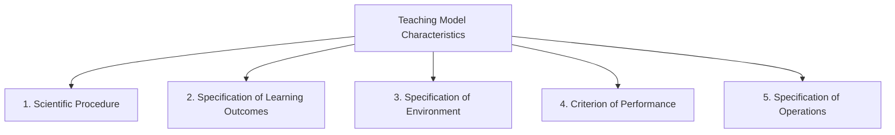

# Unit 4: Models of Teaching

## Introduction

This unit explores **Teaching Models** - systematic frameworks that guide teachers in creating effective learning environments. Think of a teaching model as a **blueprint for instruction**, similar to how an architect uses blueprints to construct buildings.

!!! info "What You'll Learn"
    - What teaching models are and why they matter
    - The six fundamental elements present in all teaching models
    - Three major categories: Philosophical, Psychological, and Modern models
    - How to apply these models in real classroom situations

---

## 4.01 What is a Teaching Model?

### Understanding the Concept

The word **"model"** has several meanings in everyday life:

1. **Miniature representation** - Like a model of the Taj Mahal
2. **Ideal figure for imitation** - Like role models we look up to
3. **Professional blueprint** - Like drawings used by architects and engineers

In education, a **Teaching Model** combines all these meanings - it's a detailed description of an ideal classroom environment designed to achieve specific learning objectives.

### Key Definitions

| Scholar | Definition |
|---------|------------|
| **Joyce & Weil (1972)** | "Teaching models are instructional designs that describe the process of specifying and producing particular environmental situations which cause students to interact in such a way that specific change occurs in their behaviour." |
| **Joyce & Weil** | "A pattern or plan which can be used to shape a curriculum, select instructional materials, and guide a teacher's actions." |
| **Paul D. Eggen (1979)** | "A teaching strategy to achieve instructional objectives, consisting of guidelines for designing educational activities and environments." |
| **Jangira (1983)** | "A set of interrelated components arranged in a sequence which provides guidelines to realize specific goals." |

!!! summary "In Simple Terms"
    A **Teaching Model** describes the ways and means of creating a favorable environmental condition to promote desirable teacher-pupil interactions that bring desirable behaviour modification in students.

---

## 4.02 Characteristics of Teaching Models

All effective teaching models share these **five key characteristics**:



### 1. Scientific Procedure
- Not a haphazard combination of facts
- A **systematic procedure** to modify learner behaviour
- Based on clear assumptions and principles

### 2. Specification of Learning Outcomes
- Clearly defines **expected performance** after instruction
- Details what students should be able to do upon completion

### 3. Specification of Environment
- Defines the **conditions** under which learning occurs
- Describes circumstances for observing student responses

### 4. Criterion of Performance
- Sets the **standard** for acceptable student performance
- Provides benchmarks for success

### 5. Specification of Operations
- Describes **mechanisms** for student-environment interaction
- Outlines how students will engage with content

!!! tip "Why This Matters"
    A teaching model works like a blueprint for engineers - it saves energy, time, and effort while ensuring optimal use of available resources in the teaching-learning process.

---

## 4.03 Functions of a Teaching Model

A teaching model serves **three essential functions**:

```
┌─────────────────────────────────────────────────────────────┐
│                    TEACHING MODEL                           │
├─────────────────┬─────────────────────┬─────────────────────┤
│   Function 1    │     Function 2      │     Function 3      │
├─────────────────┼─────────────────────┼─────────────────────┤
│ Designing &     │ Developing &        │ Specifying the      │
│ specifying      │ selecting           │ teaching-learning   │
│ instructional   │ instructional       │ activities          │
│ objectives      │ materials           │                     │
└─────────────────┴─────────────────────┴─────────────────────┘
```

---

## 4.04 Six Fundamental Elements of Teaching Models

Every teaching model can be analyzed through these **six basic elements**:

### 4.04.1 Focus
- The **central theme** or aspect emphasized in the model
- Includes teaching objectives and aspects of the teaching environment
- What the model primarily aims to achieve

### 4.04.2 Syntax
- The **sequential structure** of teaching activities
- Shows how to begin instruction and proceed further
- Describes the internal organization and inter-relationships of activities

!!! example "Think of it as..."
    Syntax is like a recipe's step-by-step instructions - it tells you the order of actions to follow.

### 4.04.3 Principles of Reactions
- Guidelines for **how teachers should respond** to student activities
- Rules for selecting appropriate responses
- Ensures responses are purposeful and selective

### 4.04.4 Social System
This covers three important aspects:

| Aspect | Description |
|--------|-------------|
| **Classroom Climate** | Autocratic, Democratic, or Laissez-faire |
| **Role Definition** | Teacher and student roles (Active or Passive) |
| **Motivation Type** | Extrinsic, Intrinsic, or Self-motivation |

### 4.04.5 Support System
Two key components:

1. **Instructional Resources**
   - Teaching aids (Audio-Visual aids)
   - Facilities (Library, Laboratory, Workshops)
   - Field trips and additional materials

2. **Evaluation Methods**
   - Testing devices to assess learning outcomes
   - Methods for measuring teaching effectiveness

### 4.04.6 Application
- Specifies **when and where** to use a particular model
- Depends on:
  - Kind of instructional objectives
  - Nature of subject matter
  - Teaching-learning situation

---

## 4.05 Classification of Teaching Models

Teaching models are classified into **three broad categories**:

```
                    TEACHING MODELS
                          │
        ┌─────────────────┼─────────────────┐
        ▼                 ▼                 ▼
   PHILOSOPHICAL     PSYCHOLOGICAL        MODERN
        │                 │                 │
   ├── Locke's       ├── Glaser's      ├── Information
   │   Impression    │   Basic Model   │   Processing
   │   Model         │                 │   
   ├── Plato's       ├── Flander's     ├── Social
   │   Insight       │   Interaction   │   Interaction
   │   Model         │   Model         │
   │                 │                 ├── Personal
   └── Kant's        └── Davies &      │   Development
       Rule Model        Stolurow's    │
                         Computer      └── Behaviour
                         Model             Modification
```

---

## 4.06 Philosophical Teaching Models

These models are rooted in philosophical traditions about how knowledge is acquired and understanding develops.

### 4.06.1 John Locke's Impression Model

!!! info "About John Locke (1632-1704)"
    - Born in Wrington, Somerset, England
    - Oxford scholar, economist, physician, and political philosopher
    - Believed in protecting natural rights: life, liberty, and property
    - A key figure among liberal philosophers

#### Core Philosophy: Tabula Rasa

Locke believed children are born with their minds like a **"blank slate"** (tabula rasa). Educational experiences are recorded in the brain as **impressions**.

```
┌─────────────────────────────────────────────────────┐
│              LOCKE'S IMPRESSION MODEL               │
├─────────────────────────────────────────────────────┤
│                                                     │
│   Child's Mind (Blank Slate)                        │
│            ↓                                        │
│   Sensory Experiences (sight, hearing, smell, touch)│
│            ↓                                        │
│   Perceptual Images stored in mind                  │
│            ↓                                        │
│   Teacher explains with illustrations               │
│            ↓                                        │
│   Understanding and Learning                        │
│                                                     │
└─────────────────────────────────────────────────────┘
```

#### Key Teaching Strategies

| Strategy | Purpose |
|----------|---------|
| Using simple teaching aids | Provide sensory experiences |
| Explaining with illustrations | Make content understandable |
| Asking questions | Check understanding |
| Summarising and reviewing | Reinforce learning |
| Writing on blackboard | Visual reinforcement |
| End-of-lesson assessment | Evaluate learning achievement |

#### Connection to Other Models

| Locke's Model Component | Glaser's Model Equivalent |
|------------------------|---------------------------|
| Preparing students for learning | Entry Behaviour |
| Presentation, Correlation, Generalization | Teaching Process |
| Application | Evaluation |

!!! note "Teacher's Role"
    In Locke's model, the teacher is **highly active** - simplifying content, presenting it in easy-to-understand ways, and using audio-visual aids to enhance learning interest.

---

### 4.06.2 Plato's Insight Model (Dialectical Method)

!!! info "About Plato (424-423 BCE)"
    - Born in Athens, ancient Greece, to an aristocratic family
    - Initially a poet, later burned his poems after meeting Socrates
    - Dedicated his life to questions of virtue and noble character
    - Used dialogue and debate for philosophical enquiry

#### Core Philosophy: Knowledge Within

Unlike Locke, Plato believed that **all knowledge is already present** in the learner's mind, deeply hidden. Teaching is about **helping students discover** this knowledge themselves.

> "By turning the eyes from looking in the wrong direction to the way it ought to be, one can observe everything correctly."

#### The Dialectical Method

Key techniques include:
- **Questioning** - To stimulate thinking
- **Discussion** - To explore ideas
- **Logical Arguments** - To test validity
- **Analysis** - To break down concepts
- **Inductive Reasoning** - To draw conclusions

#### Steps in Plato's Teaching Method

```
Step 1: Test Previous Knowledge
    │   (Through questioning)
    ▼
Step 2: Identify Elements
    │   (Help students find components of concept)
    ▼
Step 3: Classification & Categorization
    │   (Organize identified elements)
    ▼
Step 4: Higher-Order Thinking
        • Finding relationships between concepts
        • Combining known concepts to discover new ones
        • Drawing generalizations
```

#### Teacher's Role in Plato's Model

The teacher does NOT act as the "all-knowing" authority. Instead:

- **Participates** alongside students in the learning process
- **Moderates** discussions and debates
- **Demands evidence** for arguments from all sides
- **Collaborates** with students to arrive at truth

!!! tip "Key Insight"
    This process helps BOTH students gain real knowledge AND teachers update their own understanding!

---

### 4.06.3 Immanuel Kant's Rule Model

!!! info "About Immanuel Kant (1724-1804)"
    - Famous German philosopher
    - Advocated that only through **reasoning** can we acquire real knowledge
    - Emphasized **interrogation and inquiry** in classroom instruction

#### Core Philosophy: Rule-Based Learning

Kant believed solutions to problems are found through reasoning by:
- Reorganizing known facts
- Combining ideas in new ways
- Developing **rules** that govern known facts

#### Two Types of Reasoning

##### Inductive Reasoning (Specific → General)

Moving from individual observations to general principles:

```
Observation 1: Dilute Sulphuric acid + Zinc → Zinc Sulphate + Hydrogen↑
Observation 2: Dilute Nitric acid + Copper → Cupric Nitrate + Hydrogen↑
Observation 3: Dilute Hydrochloric acid + Silver → Silver chloride + Hydrogen↑
                                    ↓
        GENERAL PRINCIPLE: All metals react with dilute 
        inorganic acids to liberate hydrogen
```

##### Deductive Reasoning (General → Specific)

Testing the general principle in specific instances:

```
General Principle: All metals + dilute acids → liberate Hydrogen
                                    ↓
        Test Case: Mercury + Hydrochloric acid → Hydrogen↑
                                    ↓
        Result: Principle VERIFIED!
```

#### Practical Example: Finding Plurals in English

**Step 1: Inductive Rule Development**
```
Boy → Boys       Orange → Oranges
Girl → Girls     Cycle → Cycles
Car → Cars       Tin → Tins

RULE: Add 's' to make singular nouns plural
```

**Step 2: Testing the Rule**
```
Focus, Radius, Stimulus (words ending in 'us')
Adding 's' doesn't work here!

NEW RULE NEEDED: Replace 'us' with 'i'
Focus → Foci
Radius → Radii
Stimulus → Stimuli
```

!!! summary "Kant's Teaching Approach"
    - Subject content is taught through **rule-building and testing**
    - Goal: Develop **logical reasoning ability** in students
    - All teaching components follow specific rules

---

## 4.07 Psychological Teaching Models

These models are based on important psychological principles:
- Reinforcement
- Feedback
- Systems approach
- Classroom interaction analysis
- Motivation techniques

### 4.07.1 Glaser's Basic Teaching Model

This is considered the **foundational model** of teaching. DeCecco and Crawford regard it as the basic teaching model.

#### The Four Components

```
┌──────────────┐    ┌──────────────┐    ┌──────────────┐    ┌──────────────┐
│ INSTRUCTIONAL│───▶│   ENTERING   │───▶│ INSTRUCTIONAL│───▶│ PERFORMANCE  │
│  OBJECTIVES  │    │  BEHAVIOUR   │    │  PROCEDURES  │    │  ASSESSMENT  │
└──────────────┘    └──────────────┘    └──────────────┘    └──────────────┘
       │                   │                   │                   │
       └───────────────────┴───────────────────┴───────────────────┘
                                    ▲
                                    │
                              FEED-BACK
```

#### Component Details

| Component | Description |
|-----------|-------------|
| **Instructional Objectives** | What students should attain upon completion; defined as observable behavioural outcomes |
| **Entering Behaviour** | Student's level before instruction begins - prior knowledge, intellectual ability, motivation, social/cultural factors |
| **Instructional Procedures** | The actual teaching process; how content is delivered; where most teacher decisions are made |
| **Performance Assessment** | Tests and observations to measure achievement of objectives |

!!! example "B.Ed. Lesson Plan Connection"
    This is exactly how B.Ed. students prepare their lesson plans:
    
    1. **Instructional Objectives** - Written in terms of pupil behaviour
    2. **Previous Knowledge** - Entry behaviour assessment
    3. **Body of Lesson Plan** (4 columns):
       - Expected pupil behaviour
       - Content/concept to be taught
       - Learning experiences and materials
       - Formative evaluation
    4. **Review & Assignment** - Summative evaluation

---

### 4.07.2 Flander's Interaction Analysis Model

This model helps assess and improve teaching through **systematic observation of classroom interactions**.

#### Background

- **Gage (1968)** analyzed teaching and identified teaching skills as methods and techniques used in classroom instruction
- **B.K. Passi (1976)** identified **14 micro-skills** in classroom teaching through analysis of verbal and non-verbal behaviours

#### The 10 Categories of Classroom Interaction (FIAC)

##### Teacher Talk - Indirect Influence (Categories 1-4)
*Encourages student participation and freedom of action*

| Category | Behaviour |
|----------|-----------|
| **1** | Accepts feelings of pupils (in an unthreatening manner) |
| **2** | Praises or encourages (jokes to release tension, nods, says "go on") |
| **3** | Accepts or uses ideas of pupils (clarifies, builds on student ideas) |
| **4** | Asks questions (with intent that students answer) |

##### Teacher Talk - Direct Influence (Categories 5-7)
*Increases teacher control, aims at conformity and compliance*

| Category | Behaviour |
|----------|-----------|
| **5** | Lectures (gives facts, opinions, expresses own ideas, rhetorical questions) |
| **6** | Gives directions (commands, orders, expects compliance) |
| **7** | Criticizes or justifies authority (shouting, extreme self-reference) |

##### Student Talk (Categories 8-9)

| Category | Behaviour |
|----------|-----------|
| **8** | Student talk - Response (replies to teacher's questions) |
| **9** | Student talk - Initiation (student initiates the talk) |

##### Silence (Category 10)

| Category | Behaviour |
|----------|-----------|
| **10** | Silence or confusion (pauses, short periods of silence, noisy behaviour) |

#### How to Use FIAS

**Step 1: Observation**
- Sit where you can see and hear all participants
- Allow 5-10 minutes to get acclimatized
- Record the category number every 3-5 seconds

**Step 2: Create the Interaction Matrix**
- Add '10' at beginning and end of recorded numbers
- Convert numbers into successive pairs
- Plot pairs on a 10×10 matrix

**Step 3: Calculate Behaviour Ratios**

The **12 Key Ratios**:

| Ratio | Formula | What It Measures |
|-------|---------|------------------|
| **TTR** (Teacher Talk Ratio) | Σf[col 1-7]/N × 100 | Teacher-based activities |
| **PTR** (Pupil Talk Ratio) | Σf[col 8-9]/N × 100 | Student participation |
| **SCR** (Silence/Confusion Ratio) | Σf[col 10]/N × 100 | Dead time/confusion |
| **CCR** (Content Cross Ratio) | Σf[col 4-5]/N × 100 | Content presentation style |
| **I/D** (Indirect/Direct Ratio) | Σf[col 1-4]/Σf[col 5-7] × 100 | Teaching style balance |
| **TRR** (Teacher Response Ratio) | Σf[col 1-3]/Σf[col 1-3,6-7] × 100 | Acceptance of student ideas |

#### Using FIAS for Effective Teaching

!!! success "Democratic Teacher (Uses categories 1,2,3,4 frequently)"
    - Encourages student participation
    - Results in **high learning proficiency**
    - Creates an engaging classroom environment

!!! warning "Authoritative Teacher (Uses categories 5,6,7 frequently)"
    - Gives more directions
    - Curtails student participation
    - Increases student dependence
    - **Advised to change teaching style**

!!! danger "Ineffective Communication (Frequent category 10)"
    - Problems with verbal communication
    - Issues with classroom management
    - Needs significant improvement

---

### 4.07.3 Daniel Davies & Stolurow's Computer-Based Teaching Model

This is the **most complex** teaching model, where the computer replaces the teacher in making decisions and providing instruction.

#### Two Phases of the Model

```
┌─────────────────────────────────────────────────────────────┐
│                    PRE-TUTORIAL PHASE                       │
│                                                             │
│  Purpose: Select the most suitable instructional programme  │
│                                                             │
│  Input: • Instructional objectives                          │
│         • Entering behaviour of pupil                       │
│                                                             │
│  Computer searches for suitable programme...                │
│                                                             │
│  Results:                                                   │
│  ┌─────────────────┬─────────────────┬───────────────────┐  │
│  │ Multiple        │ One programme   │ No programme      │  │
│  │ programmes      │ found           │ found             │  │
│  │ found           │                 │                   │  │
│  ├─────────────────┼─────────────────┼───────────────────┤  │
│  │ Select least    │ Use that        │ Reject student OR │  │
│  │ cost/time       │ programme       │ Change objectives │  │
│  └─────────────────┴─────────────────┴───────────────────┘  │
└─────────────────────────────────────────────────────────────┘
                              │
                              ▼
┌─────────────────────────────────────────────────────────────┐
│                     TUTORIAL PHASE                          │
│                                                             │
│  ┌─────────────────────┐    ┌─────────────────────┐         │
│  │  TEACHER FUNCTION   │    │  PROFESSOR FUNCTION │         │
│  ├─────────────────────┤    ├─────────────────────┤         │
│  │ Puts selected       │    │ Decides changes if  │         │
│  │ programme to work   │    │ programme isn't     │         │
│  │                     │    │ effective           │         │
│  │                     │    │                     │         │
│  │                     │    │ Monitors student    │         │
│  │                     │    │ responses           │         │
│  └─────────────────────┘    └─────────────────────┘         │
└─────────────────────────────────────────────────────────────┘
```

#### Comparison with Glaser's Model

| Computer Model Phase | Glaser's Model Components |
|---------------------|---------------------------|
| Pre-Tutorial Phase | Instructional Objectives + Entering Behaviour + Instructional Procedures |
| Tutorial Phase (Teacher Function) | Instructional Procedures |
| Tutorial Phase (Professor Function) | Performance Assessment |

#### Advantages Over Conventional Instruction

| Conventional Teaching | Computer-Based Model |
|----------------------|---------------------|
| Teacher makes all decisions | Computer makes decisions |
| Usually only one programme available | Access to multiple alternative programmes |
| Limited knowledge store | Access to vast store of knowledge |
| Decisions may be inconsistent | Consistent, optimized decisions |

!!! quote "Davies & Stolurow's View"
    "Only computers have the capacity to make all the decisions and accommodations an enlightened pedagogy requires."

---

## 4.08 Modern Teaching Models

These models have different standpoints about educational goals and teaching methods. **Joyce and Weil's classification** is considered the most important, dividing them into four categories:

### 4.08.1 Information Processing Models

These models focus on **intellectual development** and help students develop:
- Creativity
- Logical thinking
- Analyzing and organizing information
- Memory retention

#### Key Information Processing Models

| Model | Exponent(s) | Primary Goals |
|-------|-------------|---------------|
| **Inductive Reasoning Model** | Hilda Taba | Developing inductive reasoning and logical analysis |
| **Enquiry Training Model** | Richard Suchman | Training in systematic inquiry |
| **Science Enquiry Model** | Joseph J. Schwab | Teaching research methods in a discipline |
| **Concept Attainment Model** | Jerome Bruner | Developing inductive reasoning and concept formation |
| **Cognitive Development Model** | Jean Piaget, Irving Sigal, Edmund Sullivan | Improving intellectual development, especially logical reasoning |
| **Advanced Organizer Model** | David Ausubel | Increasing information processing efficiency; connecting new information to existing knowledge |

---

### 4.08.2 Social Interaction Models

These models emphasize:
- Personal and social relations
- Ability to integrate with others
- Functioning harmoniously in social groups
- Democratic practices in the classroom

!!! quote "Guiding Principle"
    "All education is socialization"

#### Key Social Interaction Models

| Model | Exponent(s) | Primary Goals |
|-------|-------------|---------------|
| **Group Interaction Model** | Herbert Thelen, John Dewey | Democratic participation skills + academic inquiry |
| **Classroom Meeting Model** | Glaser | Self-understanding and social responsibility |
| **Social Inquiry Model** | Byron Massials, Benjamin Cox | Solving social problems through academic inquiry |
| **Laboratory Model** | National Training Laboratory | Self-awareness and flexibility through group skills |
| **Jurisprudent Model** | Donald Oliver, James P. Shaver | Studying social problems legally |
| **Role Playing Model** | Frennie & George Shaftel | Inquiring personal and social values |
| **Social Simulation Model** | Sarene Borock | Experiencing social processes and examining reactions |

#### Steps in Implementing Social Interaction Model

```
Step 1: Teacher introduces topic and concept outline
                    ↓
Step 2: Students form teams (5-6 members each)
                    ↓
Step 3: Team members discuss in pairs/sub-groups
        • Negotiate and compromise
        • Explain concepts to each other
        • Consult other sub-groups if needed
                    ↓
Step 4: Teams assess their completion status
                    ↓
Step 5: Team representatives present findings to class
                    ↓
Step 6: Teacher completes left-out facts and concepts
```

!!! tip "Key Features"
    - **Student-to-student interactions** are central
    - Students act as both **facilitators and learners**
    - Develops **team working skills**: compromise, negotiation, motivation
    - Teacher monitors to keep teams on task

---

### 4.08.3 Personal Development Models

These models prioritize the **affective domain** (emotions, attitudes, values) and emphasize:
- Positive relationships with environment
- Unique individuality development
- Personal goal realization
- Self-esteem and self-efficacy
- Understanding oneself and one's feelings

#### Key Personal Development Models

| Model | Exponent(s) | Primary Goals |
|-------|-------------|---------------|
| **Non-directive Model** | Carl Rogers | Self-awareness, self-concept, autonomy |
| **Awareness Training Model** | Fritz Perls | Interpersonal awareness, physical/sensory awareness |
| **Synectics Model** | William Gordon | Creativity and innovative problem-solving |
| **Conceptual System Model** | David Hunt | Personal competency and flexibility |

---

### 4.08.4 Behaviour Modification Models

Based on **B.F. Skinner's behaviourism**, these models focus on:
- Modifying pupils' behaviour
- **Operant conditioning** - shaping behaviour through reinforcement
- Developing knowledge, abilities, attitudes, and skills

#### Key Behaviour Modification Models

| Model | Exponent(s) | Primary Goals |
|-------|-------------|---------------|
| **Conditioning Teaching Model** | B.F. Skinner | Developing knowledge, abilities, attitudes, and skills through reinforcement |
| **Training Model** | B.F. Skinner | Developing psychomotor skills and social skills |

---

## Summary: Connecting the Models

```
                         TEACHING MODELS
                              │
     ┌────────────────────────┼────────────────────────┐
     │                        │                        │
     ▼                        ▼                        ▼
PHILOSOPHICAL           PSYCHOLOGICAL              MODERN
(How knowledge          (How learning              (How to achieve
is acquired)            can be optimized)          different goals)
     │                        │                        │
     │                        │                        │
┌────┴────┐              ┌────┴────┐              ┌────┴────┐
│ LOCKE   │              │ GLASER  │              │INFO     │
│(Sensory │              │(Basic   │              │PROCESS- │
│impressions)            │framework)              │ING      │
├─────────┤              ├─────────┤              ├─────────┤
│ PLATO   │              │FLANDERS │              │SOCIAL   │
│(Discovery│             │(Classroom│             │INTER-   │
│through   │             │analysis) │             │ACTION   │
│dialogue) │             ├─────────┤              ├─────────┤
├─────────┤              │DAVIES & │              │PERSONAL │
│ KANT    │              │STOLUROW │              │DEVELOP- │
│(Rule-   │              │(Computer│              │MENT     │
│based    │              │based)   │              ├─────────┤
│reasoning)│             │         │              │BEHAVIOUR│
└─────────┘              └─────────┘              │MODIFIC- │
                                                  │ATION    │
                                                  └─────────┘
```

---

## Review Questions

### Comprehension Level (C)

1. What do you understand by 'Teaching Model'? [Ans: 4.01]
2. Define 'Teaching Model'. [Ans: 4.02]
3. What are the functions of teaching model? [Ans: 4.03]

### Application Level (B)

4. What is 'Teaching Model'? What are its characteristics? [Ans: 4.01 + 4.02]
5. Briefly explain the elements of a teaching model. [Ans: 4.04]
6. Briefly explain John Locke's Impression Model of Teaching. [Ans: 4.06.1]
7. Briefly explain Plato's Insight Teaching Model. [Ans: 4.06.2]
8. Briefly explain Immanuel Kant's Rule Model of Teaching. [Ans: 4.06.3]

### Analysis Level (A)

9. Explain the three broad types of teaching models and their characteristics. [Ans: 4.05 + 4.06 + 4.07 + 4.08]
10. Explain Glaser's Basic Teaching Model and state its importance. [Ans: 4.07.1]
11. Briefly explain Flander's Interaction Model of Teaching. [Ans: 4.07.2]
12. Explain Daniel Davies's Teaching Model and how it helps pupils achieve proficiency. [Ans: 4.07.3]
13. Explain the Information Processing Model. [Ans: 4.08.1]
14. Explain how Social Interaction Model functions. [Ans: 4.08.2]
15. Explain Personal Development Model. [Ans: 4.08.3]
16. Explain Behaviour Modification Model of Teaching. [Ans: 4.08.4]

---

!!! success "Key Takeaways"
    1. Teaching models provide **systematic frameworks** for effective instruction
    2. All models share common elements: focus, syntax, principles of reaction, social system, support system, and application
    3. **Philosophical models** (Locke, Plato, Kant) address how knowledge is fundamentally acquired
    4. **Psychological models** (Glaser, Flanders, Davies) optimize the learning process through scientific analysis
    5. **Modern models** (Information Processing, Social Interaction, Personal Development, Behaviour Modification) address specific educational goals
    6. Effective teachers understand and apply multiple models based on context, objectives, and student needs
