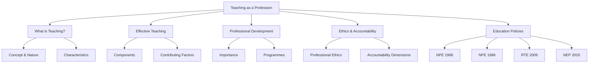
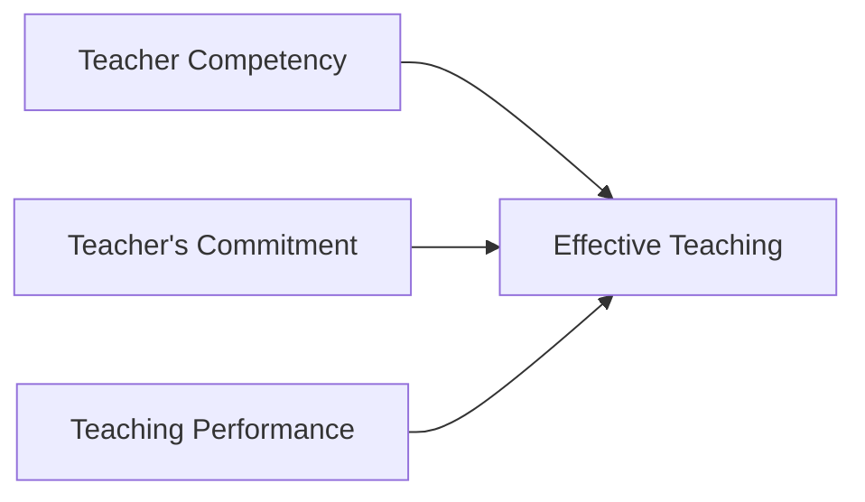
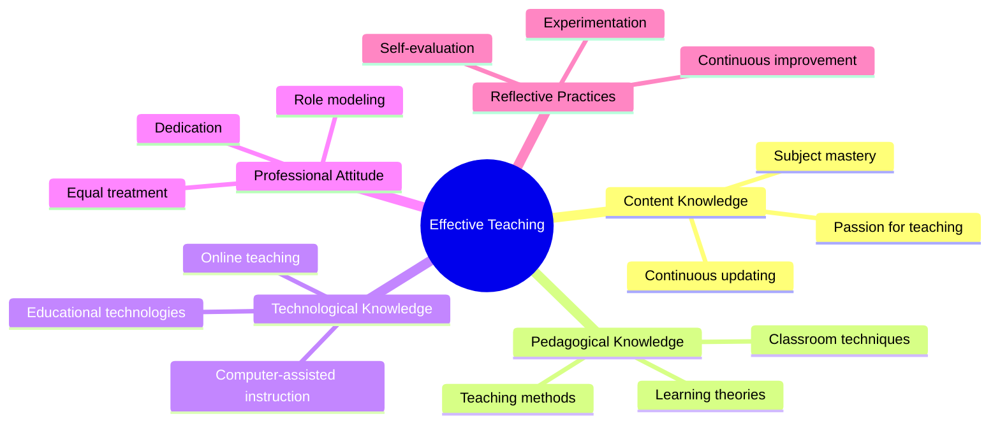
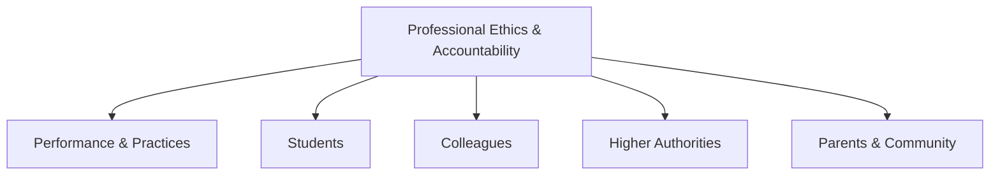
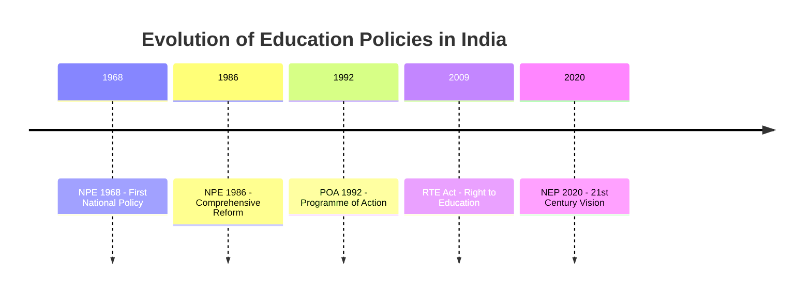
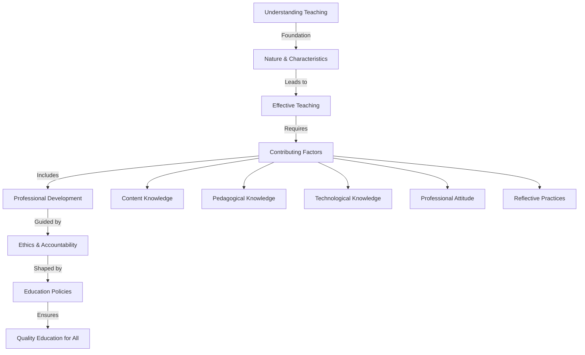

# Unit V: Teaching as a Profession

## 🎯 Unit Overview: The Big Picture

This unit explores **teaching as a noble profession** — what makes it special, what makes it effective, and what responsibilities come with it.



### Why Teaching is a "Noble Profession"

| Reason | Explanation |
|--------|-------------|
| **Nation Building** | Teachers shape future doctors, engineers, scientists, economists |
| **Human Resource Development** | Teachers develop knowledge, skills, and personality of students |
| **Social Architecture** | Teachers are called "social architects" of a country |
| **Soul Satisfying** | Teachers help bring out latent talents in students |
| **Lifelong Impact** | Students remember great teachers throughout their lives |

> **Kothari Commission** aptly remarked: *"The destiny of India is shaped within the four walls of its classroom."*

---

## 5:00 Introduction

This unit covers:

- Concept of 'Teaching' and its nature and characteristics
- Teaching as a profession
- Characteristics of **effective teaching**
- Factors contributing to effective teaching
- **Continuing professional development** of teachers
- Teacher's **professional ethics and accountability**
- Recommendations of **National Education Policies** (1968, 1986, 1992)
- **Right to Education Act** (2009)
- **National Education Policy** (2020)

---

## Part 1: Understanding Teaching

### 5:01 Concept of Teaching

!!! tip "Simple Definition"
    **Teaching** = A profession of teachers OR activities undertaken to help individuals acquire **knowledge**, **skills**, **attitudes**, and **values**.

#### Definitions by Scholars

| Scholar | Definition |
|---------|------------|
| **B.O. Smith (1960)** | "A system of actions intended to produce learning" |
| **Clarke (1970)** | "Activities designed and performed to produce change in student behaviour" |
| **H.C. Morrison** | "An intimate contact between a more mature personality and a less mature one, designed to further the education of the latter" |
| **Benjamin Bloom** | Teaching activities like lecture, question-answer, discussion, discovery, and assignments aim at achieving cognitive, affective, and psycho-motor goals |
| **B.O. Smith (1963)** | "A system of actions involving an agent, an end in view, and a situation including factors the agent can and cannot control" |

#### Three Essential Elements of Teaching

```
┌─────────────────────────────────────────────────────────┐
│                    TEACHING                              │
├─────────────────────────────────────────────────────────┤
│  1. AGENT to kindle learning                            │
│     (teacher, audio/video, books, computer)             │
│                                                         │
│  2. GOAL to be achieved                                 │
│     (learning objectives)                               │
│                                                         │
│  3. LEARNING ENVIRONMENT                                │
│     (classroom climate, methods, materials, aids)       │
└─────────────────────────────────────────────────────────┘
```

---

### 5:02 Nature and Characteristics of Teaching

Teaching has **13 key characteristics**:

#### 1. Teaching is a Complex Social Process

Many social factors make their impact on teaching.

#### 2. Teaching is Both Art AND Science

| As an ART | As a SCIENCE |
|-----------|--------------|
| Shaped by teacher's special talents | Various methods and techniques involved |
| Creative thinking | Proper training develops good teachers |
| Language fluency | Micro-skills can be taught |
| Style of presentation | Research-based approaches |
| *No two teachers teach alike* | *Systematic and learnable* |

#### 3. Teaching is a Professional Activity

- Requires specialized training
- Teachers follow **professional ethics** like doctors:
  - Care and concern for students
  - Love and affection towards them
  - Working to promote student progress
  - Treating all students equally without bias
  - Being honest and patient
  - Using punishment only to correct/reform

!!! success "Noble Profession"
    Teaching is called a **'Noble Profession'** because it requires self-dedication and involvement without measuring contribution in terms of money.

#### 4. Teaching is an Output from the Teacher

Activities to help students learn emerge from the teacher.

#### 5. Teaching is an Organized System

Teacher's classroom activities related to content presentation and student behaviour take various forms.

#### 6. Teaching is Amenable to Scientific Observation

By observing teacher activities and student-teacher interactions, teaching quality can be judged.

#### 7. Communication Skills are Primary

Teaching is mostly a linguistic process — teacher's language fluency matters greatly.

#### 8. Teaching is an Interactive Process

Face-to-face encounter with students to achieve certain objectives.

#### 9. Teaching has Different Forms and Styles

| Forms | Styles |
|-------|--------|
| Formal | Conditioning |
| Non-formal | Training |
| | Instructing |
| | Indoctrinating |

#### 10. Teaching as Therapy

Teaching may be called therapy or guidance for learners.

#### 11. Three Types of Functions

1. **Telling and Listening**
2. **Showing/Displaying**
3. **Demonstrating/Doing**

#### 12. Teaching Can Be Modified by Feedback

Continuous improvement through feedback.

#### 13. Teaching Comprises Different Skills

**Kowmisars (1966)** identified 10 skills:

1. Introducing the lesson
2. Demonstration
3. Comparing
4. Defining
5. Explaining
6. Questioning
7. Interpreting
8. Illustrating with examples
9. Justifying with evidences
10. Appraising

!!! info "Three Ways to Understand Teaching"
    Teaching can be understood as:
    
    1. **Knowledge** in a particular field
    2. **Profession**
    3. **Process**

---

## Part 2: Effective Teaching

### 5:03 Effective Teaching and Its Characteristics

#### 5:03:1 Concept and Meaning

!!! tip "Definition"
    **Effective Teaching** = Teaching that, with its relevance and quality, brings about **goal-oriented modification of behaviour** in students.

#### The Equation of Effective Teaching

```
┌──────────────────────────────────────────────────────────────┐
│                                                              │
│   EFFECTIVE    =   Teacher's    +   Teacher's    +  Achievement│
│   TEACHING         Competence       Performance     of Goals  │
│                                                              │
│   (According to Medley)                                      │
└──────────────────────────────────────────────────────────────┘
```

| Component | Meaning |
|-----------|---------|
| **Teacher Competence** | Possession of knowledge and skills needed for teaching |
| **Teacher Performance** | Use of knowledge and skills in the classroom |
| **Achievement of Goals** | Outcome of teaching (instructional objectives met) |

#### Three Dimensions of Effective Teaching

Some educationists add a third component:



---

#### 5:03:2 Characteristics of Effective Teaching

**12 characteristics** of skilful teachers:

##### 1. Presenting Content Logically in Sequential Order

- Analyze lesson content before teaching
- Identify important concepts
- Organize sequentially
- Present key points cogently for meaningful learning

##### 2. Simplifying Content and Presenting with Clarity

- Simplify difficult concepts
- Explain clearly using:
  - Day-to-day life illustrations
  - Appropriate metaphors and comparisons
  - Simple sentences
  - Relevant incidents
- State objectives clearly at the beginning
- Give an overview of the day's lesson

##### 3. Using Analytic and Synthetic Approach

```
WHOLE CONCEPT → Break into COMPONENTS → Explain each → INTEGRATE back
```

##### 4. Having Better Communication Skills

| Skill | Description |
|-------|-------------|
| Lucid language style | Clear and simple |
| Eye contact | Engagement with students |
| Voice modulation | Varying tone and pitch |
| Body language | Appropriate gestures |
| Facial expressions | Convey meaning |

##### 5. Using Variety of Teaching Techniques

- Demonstration
- Dramatisation
- Narrating episodes
- Describing
- Drill and practice
- Assignments
- Multimedia presentation

##### 6. Using Appropriate Teaching Aids

- Charts, models, maps
- Slides, recorded speeches
- Science demonstrations for concrete experiences

##### 7. Motivating Students

- Relate new content to previous knowledge
- Appreciate students for right answers

##### 8. High Student-Participation

Organize teaching to promote appropriate interactions and involvement.

##### 9. Good Classroom Management

| Component | Action |
|-----------|--------|
| Calling pupils by name | Personal connection |
| Making norms for classroom behaviour | Clear expectations |
| Reinforcing attending behaviour | Positive reinforcement |
| Focussing attention | Keep students engaged |
| Controlling distractions | Minimize disruptions |
| Keeping students under control | Maintain discipline |
| Stopping undesirable behaviour | Immediate correction |

##### 10. Appropriate Use of Black Board

Write key points legibly, clearly, neatly, and briefly.

##### 11. Evaluating Student Learning

| Type | When | Purpose |
|------|------|---------|
| **Formative Assessment** | During teaching | Know how far students understand |
| **Summative Assessment** | End of teaching | Review what students have learned |

##### 12. Providing Appropriate Feedback

- Explain why wrong answers are wrong
- Assess learning through tests
- Provide feedback to improve learning

---

### 5:04 Factors Contributing to Effective Teaching

Five key factors:



---

#### 5:04:1 Teacher's Content Knowledge

- **Mastery** in the subject being taught
- **Curiosity** to approach content from different angles
- **Passion** for teaching (includes learning, participation, collaboration, cooperation, activism)
- **Continuous updating** through new publications and journals

---

#### 5:04:2 Pedagogical Knowledge

Knowledge gained during teacher training about:

- Developmental stages of students
- Stages of cognitive development
- Theories of learning and their implications
- Factors affecting learning
- Techniques to promote better memory
- Theories of motivation
- Classroom techniques for motivating students

**Focus areas in teaching:**

| Area | Description |
|------|-------------|
| Content analysis | Arranging subject content sequentially |
| Simplification | Explaining clearly with examples |
| Methods | Using inductive and deductive approaches |
| Communication | Fluent, lucid language with good body language |
| Techniques | Adopting appropriate teaching methods |
| Instructional aids | Using suitable materials |
| Motivation | Using intrinsic and extrinsic motives |
| Participation | Keeping learner involvement high |
| Management | Efficient classroom control |
| Evaluation | Using formative and summative assessments |
| Feedback | Providing proper guidance |

---

#### 5:04:3 Technological Knowledge

Modern educational technologies include:

- Instructional Television
- Computer Software
- Audio Tapes and Video Discs
- Computer Assisted Instruction
- Multimedia presentations
- E-tutoring
- Online classes using internet

!!! warning "Essential Skill"
    Every teacher must possess knowledge about these educational technologies.

---

#### 5:04:4 Professional Attitude

**10 essential attitudes** for teachers:

1. **Teaching is challenging** — aims at developing total personality of all students
2. **Be a role model** — exemplary character, dedication, pleasant behaviour, perseverance
3. **All students can learn** — some easily, others with more effort; pay extra attention to struggling students
4. **Teaching is service** — not a lucrative profession for money but nation-building service
5. **Continuous learning** — don't be satisfied with pre-service training; keep updating
6. **Multifaceted skills** — bookish knowledge is not enough; encourage varied learning activities
7. **Treat everyone equally** — accept that everyone has some ability
8. **Social concern** — responsibilities extend beyond education
9. **Professional ethics** — behave with self-restraint following code of conduct
10. **Be a role model outside class** — duty doesn't end with classroom teaching

---

#### 5:04:5 Reflective Practices

- **Don't be satisfied** with pre-service training alone
- **Reflect** on your own teaching when alone
- **Think** about how to improve delivery using different techniques and technologies
- **Experiment** with new approaches in classroom teaching

!!! success "Key Insight"
    Only teachers who continuously reflect and improve can remain effective throughout their careers.

---

### 5:05 Reasons for Considering Teaching as an Important Profession

**Six counts** that make teaching a superior profession:

| # | Reason |
|---|--------|
| 1 | Well-defined educational and professional qualifications |
| 2 | Special training in teaching methods, techniques, skills, and class management |
| 3 | Specific professional ethics for teachers |
| 4 | Life-long commitment to renew knowledge and practices |
| 5 | Work in cooperation with colleagues for student improvement |
| 6 | Reflect upon and continuously improve teaching performance |

#### The Impact of Teachers

> "Buildings built by an incompetent engineer may disintegrate shortly... A poorly trained physician may affect a few hundred people. But the teaching of a bad teacher spoils the life of people for **many generations** to come."

That is why teachers are called **"Social Architects"** of a country.

---

## Part 3: Professional Development

### 5:06 Continuing Professional Development of Teachers

#### 5:06:1 Concept

!!! tip "Definition"
    **Professional Development** = Individuals or groups getting their professional knowledge and skills **expanded and/or deepened**.

Professional development includes:

- Formal classes, seminars, workshops
- Teaching-related conferences
- Online courses
- Independent study

**Types:**

- **Mandatory** (school, district, or state levels)
- **Voluntary** (self-pursued)

**Focus areas:**

- New teaching techniques and methodology
- Implementation strategies
- General skills (interpersonal communication)
- Related subjects (child psychology)

!!! info "Holistic Approach"
    Professional development promotes **continuous improvement** and **overall growth** in teachers — based on Kothari Education Commission recommendations.

---

#### 5:06:2 Importance of Professional Development

Why in-service education is essential:

- Teaching techniques considered best years ago may become **irrelevant**
- Some subjects/topics may **lose importance**
- **Rapidly evolving technology** demands new skills
- **Society's changing requirements** need new approaches
- Curriculum and syllabi get **revised** regularly

Teachers must refresh themselves through **continuous in-service programmes**.

---

#### 5:06:3 Professional Development Programmes

| Programme | Description |
|-----------|-------------|
| **Seminar** | Collective thinking over educational problems under expert guidance |
| **Refresher Courses** | Educational programmes to refresh knowledge with new developments |
| **Workshops** | More practical work, less theoretical discussion; produce final materials |
| **Conference** | Broad discussion with central theme; teachers present papers |
| **Study Groups** | Teachers of same subject with expert discuss topics of common interest |
| **Study Centre for Professional Writings** | Reference materials from NCERT and other centres |
| **Experimental Schools** | Practising schools for instructional experiments and demonstrations |
| **Summer Institutes** | 3-5 week training on new inventions, technologies, methods, research skills |
| **Correspondence Courses** | Distance learning for in-service teachers |

**Other programmes:**

- Educational Tours
- Radio Broadcast
- Film Shows
- TV Programmes
- Extension lectures
- Exhibitions
- Exchange of teachers

---

#### 5:06:4 Institutions Providing In-service Training

1. **Colleges of Education with Extension Services Department**
2. **State Institute of Education (SIE)**
3. **State Institute of Science** — for science teachers
4. **Regional Institute of English** — 4-month certificate courses
5. **State Council for Education, Research and Training (SCERT)**
6. **State Academic Staff Colleges** (Human Resource Centres)

---

## Part 4: Professional Ethics and Accountability

### 5:07 Teacher's Professional Ethics and Accountability

#### 5:07:1 Concept of Teacher's Professional Ethics

!!! tip "Definition"
    **Professional Ethics** = Moral restrictions or code of conduct for the teaching profession. The behaviour of an ideal teacher is called **ethical behaviour**.

**Expected qualities:**

- Calm, patient, communicative temperament
- Amiable disposition
- Responsibility for students' academic achievement
- Being a good role model
- Faithfulness to the institution
- Full involvement in educational activities
- Treating all students equally
- Respecting rules and regulations
- Obeying superiors
- Interest in continuous professional development

---

#### 5:07:2 Meaning of Teacher's Professional Accountability

!!! tip "Definition"
    **Accountability** = Being responsible for one's actions, particularly for non-accomplishment of assigned responsibilities or non-fulfilment of expectations.

Teachers are accountable for:

- Students' poor performance
- Failing to help students improve steadily
- Must be evaluated on **objective criteria** (Minimum Levels of Learning)

---

#### 5:07:3 Dimensions of Professional Ethics and Accountability

Five important dimensions:



---

##### 5:07:3:01 Related to Performance and Practices

1. Taking responsibility for teaching activities and practices
2. Functioning honestly and objectively; protecting dignity of profession
3. Having good physique and healthy mind; dedication
4. Joining with prescribed qualifications; following appointment terms
5. Seeking professional growth through study and research
6. Refraining from acting against institutional rules
7. Using funds honestly with proper documentation
8. Avoiding personal gains from institution's goodwill or position

---

##### 5:07:3:02 Related to Students

1. Using various techniques and aids for optimal learning proficiency
2. Undertaking continuous assessment and providing feedback
3. Making students good disciplinarians and rule-abiding citizens
4. Treating all students with dignity
5. Not disclosing confidential student information
6. Safeguarding students from harm
7. Reporting achievement and behaviour truthfully
8. Being available beyond school hours for students with special needs
9. **Not taking private tuitions** for money

---

##### 5:07:3:03 Related to Colleagues

1. Treating others as you wish to be treated
2. Maintaining confidentiality about colleagues
3. Not making unsubstantiated allegations
4. Not acting against colleagues' freedom and interests
5. Joining in professional development activities
6. Helping make school environment conducive for education

---

##### 5:07:3:04 Related to Authorities

1. Discharging responsibilities according to existing rules
2. Performing duties to the best of ability
3. Involving voluntarily in institutional projects
4. Following contractual obligations
5. Giving sufficient notice when resigning
6. Avoiding unnecessary leave; giving prior intimation

---

##### 5:07:3:05 Related to Parents and Community

1. Sending regular reports on student progress
2. Participating in parent-teacher meetings
3. Recognizing education as **Public Service**
4. Keeping public informed of educational programmes
5. Making public aware of social problems and solutions
6. Not promoting hatred among communities
7. Respecting cultural values of diverse communities
8. Showing concern for students from weaker sections

---

## Part 5: National Education Policies

### 5:08 Recommendations of Various National Policies on Education



---

### 5:08:1 National Policy on Education — 1968

Based on the **Education Commission (1964-1966)** report, announced by Prime Minister **Indira Gandhi**.

#### Main Objectives

1. **Radical restructuring** of education
2. **Equalization** of educational opportunities
3. Strengthening **national integration** and achieving cultural/economic development

#### Key Features (5:08:1:01)

| # | Feature |
|---|---------|
| 1 | **Compulsory education** for all children up to age 14 (Constitutional mandate) |
| 2 | **Enhancing teacher qualifications** and training quality; improving emoluments |
| 3 | **Three-language formula**: Regional language + English + Hindi |
| 4 | **Regional language** as medium of instruction |
| 5 | Language education to reduce **gulf between intelligentsia and masses** |
| 6 | Encourage **Hindi** as common language; teach **Sanskrit** as cultural heritage |
| 7 | Spending on education to increase to **6% of GDP** |
| 8 | **Priority to science and mathematics** in school education |
| 9 | Balance between **education output and employment** opportunities |
| 10 | Improve **quality of books**; special attention to children's books and regional language university books |
| 11 | **Examination reforms** — improve reliability and validity; continuous evaluation |
| 12 | College/university admissions based on **infrastructure and staff strength** |
| 13 | Develop **part-time and correspondence courses** at university level |
| 14 | Protect and promote **minority educational interests** |
| 15 | Uniform structure: **10+2+3 pattern** throughout the country |
| 16 | Government to **review progress every five years** |

---

### 5:08:2 National Policy on Education — 1986

Prime Minister **Rajiv Gandhi** presented "Challenge of Education: A Policy Perspective" to prepare India for 21st-century challenges.

#### Issues Considered for Reform

1. National system of education
2. Centre-state partnership
3. Education for equality
4. Universalisation of elementary education
5. Adult education
6. Pace-setting schools
7. Vocationalisation of education
8. Delinking degrees from jobs
9. Raising status of teachers
10. Management of education
11. Indian Education Service
12. Role of community and voluntary organisations
13. Resource mobilisation

---

#### 5:08:2:02 Salient Features

##### 1. Goals of Education

- Strengthen principles of **equity, freedom, self-dependence**
- Promote **national unity** and spirit of excellence
- Develop **broad national outlook** among youngsters

##### 2. National System of Education

- Education of **comparable quality** for all students (regardless of caste, creed, location, sex)
- Common structure: **10+2+3 pattern** (5+3+2 for school)
- National curricular framework
- **Minimum Level of Learning** competencies for each stage
- Work experience at all levels
- Science education compulsory till secondary

##### A) Primary Education

1. Enrol and retain all children under 14
2. Pupil-centered methods; focus on learning capabilities
3. Basic infrastructure: buildings, furniture, equipment, teaching aids, playgrounds, qualified teachers
4. **Operation Black-Board** — immediate implementation
5. Adjust school timing for rural children's agricultural needs
6. **Individualized Instruction** for first-generation learners
7. Eliminate stagnation at elementary stage
8. Non-formal education for dropouts
9. Goal: **100% literacy by 2000 AD**

##### B) Secondary Education

- **Vocationalisation** of secondary education
- **Navodaya Schools** — pace-setting schools for talented rural students

##### C) Technical Education

- AICTE established for planning, standards, accreditation, monitoring
- Computer education from +2 stage
- Curb commercialization of technical education

##### D) Higher Education

- Encourage **autonomous colleges** based on performance
- Encourage department autonomy in universities
- State-level councils of higher education
- UGC to encourage research in thrust areas
- **Open universities** for broader access
- **Delinking degrees from jobs** in selected areas
- National testing service for entrance exams

##### E) Teacher Education

- Admission based on **merit and aptitude** through entrance examination
- **National Council for Teacher Education (NCTE)** established
- Upgrade training schools to **DIETs** (District Institutes of Education and Training)
- Upgrade training colleges to **IASEs** (Institutes of Advanced Study in Education)
- Establish **Teacher Recruitment Boards (TRB)**
- Improve pay and service conditions
- Lay down **norms of accountability**

##### F) Miscellaneous

- **Value education** for national unity
- Three-language policy with more energy
- Work experience at all levels
- **Science education** compulsory till secondary
- **Yoga** in schools for integrated body-mind development
- **Examination reform**: Semester system, Continuous Internal Assessment, Credit System, Question Banks
- **Indian Educational Service** on lines of IAS and IPS

---

### 5:08:3 Programme of Action — POA (1992)

#### Goal

Implement NPE to provide **quality education to all** without discrimination.

#### Objectives

**Elementary Level:**
- Access, retention, and completion by all children up to age 14
- Continuous quality improvement

**Secondary Level:**
- Quality improvement
- Computer knowledge and skills

**Higher Level:**
- Reflect on national problems (social, economic, cultural, moral)

**General:**
- Remove regional and social disparities
- Empower women and disadvantaged groups
- Free and compulsory education
- Facilities for special children
- Eradicate illiteracy
- Education for equal status of women
- Special attention to SC, Adivasis, Minorities

#### Special Programmes

- Pre-primary schools, Balwadis, Anganwadis
- **Operation Black Board** for basic facilities
- **Navodaya School** in every district
- SUPW integrated with primary education
- **Autonomous status** for performing colleges
- Rural Universities based on Gandhian principles
- Teacher accountability for discipline and performance
- **Minimum Levels of Learning** prescribed
- Grading system instead of marks
- Three-language formula; Hindi as link language
- Upgrade selected institutions to **DIETs/IASEs**

---

### 5:08:4 Right to Education Act — 2009

#### 5:08:4:01 Background

- **Article 45** (Directive Principle) was not a constitutional obligation
- **2002**: Constitution amended, inserting **Article 21-A**
- **August 4, 2009**: RTE Act passed by Parliament
- **April 1, 2010**: Rules came into effect

!!! success "Fundamental Right"
    Education became a **Fundamental Right** for children aged 6-14.

---

#### 5:08:4:02 Salient Features

##### 1. Compulsory and Free Education for All

- Government must provide **free and compulsory education** up to Class 8
- School within **1 km** of every child's residence
- Government must establish schools within **3 years**
- Ensure admission, attendance, and **completion** of elementary education
- **Free textbooks, uniforms, stationery**, and materials for disabled children
- Funding shared by **Central and State governments**

##### 2. Benchmark Mandate for Primary Education

Norms for:
- Teacher-pupil ratio
- Number of classrooms
- Separate toilets for girls and boys
- Drinking water facility
- School working days
- Working hours of teachers

##### 3. Special Provisions for Out-of-School Children

- Admit to **age-appropriate class**
- Provide **special training** to bring to appropriate learning level

##### 4. Teacher Quality and Quantity

**Teacher-Pupil Ratio:**

| Level | Ratio |
|-------|-------|
| Primary (I-V) | 2 teachers up to 60 children; Max 1:40 for schools >200 students |
| Middle (VI-VIII) | Science-1, Math-1, Social Science-1, Language-1 (minimum) |

**Other requirements:**
- No disparity between rural and urban schools
- Appropriately trained teachers with requisite qualifications
- **No deployment for non-academic work** (except census, elections, disaster relief)

**Teacher Duties:**
- Regularity and punctuality
- Complete syllabus on time
- Assess every child's learning ability
- Provide special instruction if needed
- Meet parents regularly

##### 5. Zero Tolerance Against Discrimination

- **No screening test** for admission
- **Capitation fee/donation** is criminal offence
- **No birth certificate** required for admission
- **No corporal punishment** or mental harassment
- No private schools without government approval
- **No discrimination** based on caste, religion, gender, economic class

##### 6. All-round Development of Children

- Curriculum aligned with **Constitutional values**
- Build knowledge, potentiality, and talent
- Child **free of fear, trauma, and anxiety**
- **Child-friendly and child-centred** learning

##### 7. No Detention Policy

- No child held back before completing elementary education
- **Continuous and Comprehensive Evaluation (CCE)** for grade-appropriate outcomes
- Encourage co-curricular activities

##### 8. School Management Committees

Composition:
- Headmaster, teacher
- Local elected representative
- Parents' representatives
- Social activist
- **3/4 members** must be parents
- **Half members** must be women

Role: Monitor functioning and prepare developmental plans

##### 9. Grievance Redressal

**Grievance Redressal Cell** to handle non-compliance complaints.

##### 10. Social Inclusion

- Private schools must reserve **25% seats** for disadvantaged and economically weaker sections
- State government reimburses tuition fee

!!! success "Impact"
    After RTE implementation, **net enrolment rate** in primary schools (2014-15):
    
    - Overall: **91%**
    - Girls: **90%**

---

### 5:08:5 National Education Policy — 2020

First education policy of the **21st century**, replacing NPE 1986.

- Approved: **July 29, 2019** (Cabinet headed by PM Narendra Modi)
- Committee: Headed by **Dr. K. Kasturirangan** (June 2017)
- Draft submitted: **May 31, 2019** (over 2 lakh suggestions received)
- Effective from: **2026**

---

#### 5:08:5:01 School Education

##### 1. Universal Access

**Goal**: 100% Gross Enrolment Ratio by 2030

Initiatives:
- Effective infrastructure and educational aids
- Alternative and innovative education centres
- Bring dropouts back to mainstream

##### 2. Quality Early Childhood Care and Education

- Quality ECCE for all children **3-6 years** by **2025**
- **NCPFECCE** (National Curricular and Pedagogical Framework) by NCERT
- Joint implementation by HRD, WCD, Health, and Tribal Affairs ministries

##### 3. New Curricular Structure: 5+3+3+4

```
┌─────────────────────────────────────────────────────────────────┐
│              NEW SCHOOL STRUCTURE: 5+3+3+4                       │
├─────────────────────────────────────────────────────────────────┤
│                                                                 │
│  FOUNDATIONAL STAGE (Ages 3-8) - 5 years                        │
│  ├── 3 years Anganwadi/Pre-school                               │
│  └── 2 years Primary (Grades 1-2)                               │
│      → Play-based and activity-based learning                   │
│                                                                 │
│  PREPARATORY STAGE (Ages 8-11) - 3 years                        │
│  └── Grades 3, 4, 5                                             │
│      → Science, Math, Social Science, Humanities                │
│      → Experiential learning                                    │
│                                                                 │
│  MIDDLE STAGE (Ages 11-14) - 3 years                            │
│  └── Grades 6, 7, 8                                             │
│      → Subject-oriented pedagogical style                       │
│                                                                 │
│  SECONDARY STAGE (Ages 14-18) - 4 years                         │
│  ├── Phase 1: Grades 9-10                                       │
│  └── Phase 2: Grades 11-12                                      │
│      → Greater depth, critical thinking                         │
│      → Flexibility, student choice                              │
│      → Exit option at Grade 10, re-enter at Grade 11            │
│                                                                 │
└─────────────────────────────────────────────────────────────────┘
```

##### 4. Removing Artificial Gaps

- Between arts and sciences
- Between curricular and extra-curricular
- Between vocational and academic streams

##### 5. Foundational Literacy and Numeracy

**National Mission** for early language and mathematical skills (Grades 1-3) by **2025**.

##### 6. Multilingualism and Indian Languages

- Medium of instruction: **Mother tongue/regional language** until at least Grade 5 (preferably Grade 8)
- **Sanskrit** offered at all levels (optional under three-language formula)
- Other classical languages: Tamil, Telugu, Kannada, Malayalam, Odia, Pali, Persian, Prakrit
- Foreign languages at secondary level: Korean, Japanese, Thai, French, German, Spanish, Portuguese, Russian

##### 7. Assessment Reform

- Maximum **two Board exams** per class (Main + Improvement)
- **PARAKH** (Performance, Assessment, Review and Analysis of Knowledge for Holistic Development) — national standard-setting body

##### 8. Equitable and Inclusive Education

- Special emphasis on **Socially and Economically Disadvantaged Groups**
- Separate **Gender Inclusion Fund**
- **Special Education Zones** for disadvantaged regions

##### 9. Teacher Recruitment and Career

- **Transparent recruitment** processes
- **Merit-based promotions** with multi-source appraisals
- **National Professional Standards for Teachers** by 2022 (by NCTE)
- Review and revision in 2030, then every 10 years

##### 10. School Governance

- Schools organized into **complexes or clusters**
- **State School Standards Authority** to be set up
- **School Quality Assessment and Accreditation Framework (SQAAF)** by SCERT

---

#### 5:08:5:02 Higher Education

1. Increase **Gross Enrolment Ratio to 50%** by 2035
2. **Multi-disciplinary education** with multiple entry/exit options
3. **National Testing Agency** for common entrance examinations
4. **Flexible degree duration**: 3 or 4 years
   - 1 year: Certificate
   - 2 years: Diploma
   - 3 years: Bachelor's degree
5. **Multi-disciplinary Education and Research Universities (MERUs)**
6. **Academic Bank of Credit (ABC)** — digital storage of academic credits
7. **National Research Foundation** for research and innovation
8. **Higher Education Commission of India (HECI)** with four bodies:
   - General Education Council (standards)
   - Higher Education Grants Council (funding)
   - National Accreditation Council (accreditation)
   - National Higher Education Regulatory Council (regulation)
9. Expand **Open and Distance Learning**
10. **Internationalization of Education**

---

#### 5:08:5:03 Professional Education

Professional education to be integral part of higher education. Stand-alone universities (technical, health science, legal, agricultural) will become **multi-disciplinary**.

---

#### 5:08:5:04 Teacher Education

- **4-year integrated bachelor's degree** for teaching
- Stage-specific qualifications:
  - 1 year: Certificate
  - 2 years: Diploma
  - 4 years: Bachelor's degree
- Subject-specific specialization
- **National Educational Technology Forum (NETF)** for technology integration

---

#### 5:08:5:05 General Recommendations

1. Achieve **100% youth and adult literacy**
2. Combat **commercialization** of higher education
3. All institutions as **'not for profit'** entities
4. Increase **public investment to 6% of GDP**
5. Strengthen **Central Advisory Board of Education**
6. Re-designate MHRD as **Ministry of Education (MoE)**

---

## 🎯 Key Takeaways: How Everything Connects



### Summary: The Complete Picture

1. **Teaching** is both an art and science, a noble profession requiring dedication
2. **Effective Teaching** combines competence, commitment, and performance
3. **Five factors** contribute to effectiveness: content knowledge, pedagogy, technology, attitude, reflection
4. **Professional development** is continuous and essential
5. **Ethics and accountability** guide teacher behaviour toward all stakeholders
6. **Education policies** have evolved to ensure quality education for all Indians

---

## 📝 Review Questions

1. Define 'Teaching' and explain its nature and characteristics. **(A)** [Ans: 5:01 + 5:02]

2. Explain the concept of 'Effective Teaching'. **(B)** [Ans: 5:03:1]

3. What is 'Effective Teaching'? Explain its characteristics. **(A)** [Ans: 5:01 first two paragraphs + 5:03:2]

4. Explain the factors contributing to effective teaching. **(A)** [Ans: 5:04 + 5:04:1 to 5:04:5]

5. Analyse the reasons for considering teaching as an important profession. **(A)** [Ans: 5:05]

6. Explain the concept of 'Teachers' Professional Development' and state its importance. **(B)** [Ans: 5:06:1 + 5:06:2]

7. What is teachers' professional development? Explain some of the teacher development programmes. **(A)** [Ans: 5:06:1 + 5:06:3]

8. Write a short note on institutions providing in-service training. **(C)** [Ans: 5:06:4]

9. Explain 'Teacher's Ethics and Accountability'. **(B)** [Ans: 5:07:1 + 5:07:2]

10. Explain the dimensions of Teacher's Ethics and Accountability. **(A)** [Ans: 5:07:3 + 5:07:3:01 to 5:07:3:05]

11. Briefly explain the salient features of National Education Policy (1968). **(B)** [Ans: 5:08:1 + 5:08:1:01]

12. Briefly explain the recommendations of National Educational Policy (1986). **(A)** [Ans: 5:08:2 + 5:08:2:01 + 5:08:2:02]

13. State the important recommendations of Programme of Action on National Educational Policy (1986). **(B)** [Ans: 5:08:3 + 5:08:3:01 + 5:08:3:02]

14. Briefly explain the recommendations of Right to Education Act, 2009. **(A)** [Ans: 5:08:4:01 + 5:08:4:02]

15. Explain the important recommendations of National Education Policy (2020) regarding 'Teacher Education' and 'Teaching Profession'. **(B)** [Ans: 5:08:5:04 point 1 + 5:08:5:01 point 11]

16. Explain the recommendations of National Education Policy (2020) regarding School Education and Higher Education. **(B)** [Ans: 5:08:5 + 5:08:5:01 first 10 points + 5:08:5:02]

17. Explain the recommendations of National Education Policy (2020) regarding Teacher Education. **(B)** [Ans: 5:08:5:04]

18. Briefly explain the important recommendations of National Education Policy (2020). **(A)** [Ans: 5:08:5 + 5:08:5:01 + 5:08:5:02]
